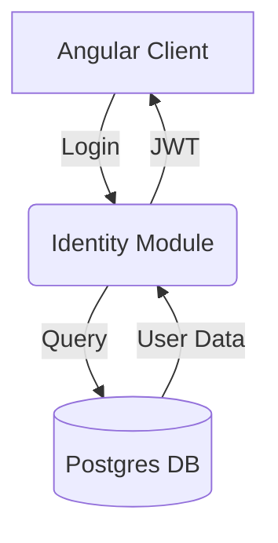

# 🏦 KuboBank — Arquitectura MVP

> Documento de referencia técnica. Todo lo acordado en la fase de diseño antes de implementación.

---

## 🛠 Stack Tecnológico

| Decisión | Tecnología |
|---|---|
| Lenguaje | Kotlin (JDK 17+) |
| Framework | Spring Boot + Spring Modulith |
| Build | Gradle (Kotlin DSL) — **Multi-project build** |
| Arquitectura | Clean Architecture + DDD + CQRS |
| Persistencia | MyBatis |
| Migraciones | Liquibase (changelog `.yml`, scripts `.sql`) |
| Base de datos | PostgreSQL |
| Eventos | Spring Modulith Event Publication Registry + Outbox Pattern |
| Contenedores | Docker / Docker Compose |
| Package base | `sv.com.kubobank` |

---

## 🏗 Principios Arquitectónicos

- **Clean Architecture**: La lógica de negocio es independiente de frameworks, base de datos y cualquier agente externo.
- **DDD (Domain-Driven Design)**: El modelo refleja el lenguaje del negocio. Cada Bounded Context es autónomo.
- **CQRS**: Separación estricta entre operaciones de escritura (Commands) y lectura (Queries).
- **Event-Driven**: Todo cambio de estado produce un Domain Event. Sin procesos batch.
- **Idempotency**: This is vital. If a "Deposit" event is sent twice, you don't want to add money to the user's account twice. (Pendiente!)
- **Outbox Pattern**: Garantía de consistencia entre persistencia y publicación de eventos (via Spring Modulith).
- **Monolito Modular**: Un solo repositorio con módulos físicamente separados por responsabilidad. Diseñado para escalar a microservicios sin refactoring mayor.
- **Arquitectura Simétrica**: Cada dominio en el backend (`libs/domains/ledger`) tiene una librería espejo en el frontend (`libs/ledger`).

---

## 🔐 Seguridad

### Proveedor de Identidad
**Auth0** actúa como IdP externo. Spring Security valida el JWT emitido por Auth0 — no gestiona passwords ni sesiones propias.

### Flujo de Autenticación
```
Backoffice (Electron + Angular)
        ↓
Auth0 — Authorization Code + PKCE
        ↓
JWT access token (contiene sub + roles como custom claims)
        ↓
Spring Backend — valida JWT contra Auth0 JWKS endpoint
        ↓
Extrae roles → aplica autorización por endpoint
```

### Roles MVP

| Rol | Descripción | Responsabilidad |
|---|---|---|
| `ROLE_CUSTOMER` | Usuario final | Consulta sus propias cuentas y saldos, inicia transacciones desde la perspectiva del cliente |
| `ROLE_OPERATOR` | Operador de ventanilla | Atiende clientes, registra depósitos, retiros, transferencias y da soporte operativo |
| `ROLE_FINANCE` | Analista financiero | Cuadra los libros contables, consulta el ledger completo y registra ajustes manuales |
| `ROLE_ADMIN` | Administrador del sistema | Control total del sistema y de Auth0: usuarios, roles, monedas, jurisdicciones y reversiones |

> Los roles viajan como **custom claims dentro del JWT** emitido por Auth0. KuboBank no almacena roles en base de datos en el MVP. Esto permite migrar a RBAC granular en el futuro sin tocar el dominio.

### Gestión de Usuarios y Roles — MVP (Opción A: Auth0 Dashboard)

**Decisión MVP**: Usuarios y roles se gestionan **manualmente desde el Auth0 Dashboard**. No se desarrolla módulo de gestión de identidades en el MVP.

#### Proceso de configuración en Auth0 Dashboard

**1. Crear roles** en Auth0 Dashboard → User Management → Roles:
```
ROLE_CUSTOMER
ROLE_OPERATOR
ROLE_FINANCE
ROLE_ADMIN
```

**2. Crear usuarios** en Auth0 Dashboard → User Management → Users. Asignar rol en la pestaña "Roles".

**3. Configurar Action para inyectar roles en el JWT**
```javascript
exports.onExecutePostLogin = async (event, api) => {
  const namespace = 'https://kubobank.sv/roles';
  const roles = event.authorization?.roles ?? [];
  api.accessToken.setCustomClaim(namespace, roles);
};
```

**4. Registrar API en Auth0** → Applications → APIs:
- **Audience:** `https://api.kubobank.sv`

#### Limitaciones de Opción A en producción
- Sin trazabilidad interna de cambios de roles
- No escala más de ~10 operadores
- Sin flujo de onboarding automatizado

---

### Matriz de Autorización por Endpoint

| Endpoint                         | ADMIN | FINANCE | OPERATOR | CUSTOMER |     |
| -------------------------------- | ----- | ------- | -------- | -------- | --- |
| `POST /customers`                | ✅     | ❌       | ✅        | ❌        |     |
| `GET /customers/**`              | ✅     | ✅       | ✅        | ❌        |     |
| `PATCH /customers/*/activate`    | ✅     | ❌       | ✅        | ❌        |     |
| `PATCH /customers/*/suspend`     | ✅     | ❌       | ✅        | ❌        |     |
| `POST /accounts`                 | ✅     | ❌       | ✅        | ❌        |     |
| `GET /accounts/**`               | ✅     | ✅       | ✅        | ✅        |     |
| `PATCH /accounts/*/freeze`       | ✅     | ❌       | ✅        | ❌        |     |
| `PATCH /accounts/*/close`        | ✅     | ❌       | ✅        | ❌        |     |
| `POST /transactions`             | ✅     | ❌       | ✅        | ✅        |     |
| `GET /transactions/**`           | ✅     | ✅       | ✅        | ✅        |     |
| `PATCH /transactions/*/reverse`  | ✅     | ❌       | ❌        | ❌        |     |
| `GET /fx/rates`                  | ✅     | ✅       | ✅        | ✅        |     |
| `GET /currencies/**`             | ✅     | ✅       | ✅        | ✅        |     |
| `PATCH /currencies/*/deactivate` | ✅     | ❌       | ❌        | ❌        |     |
| `GET /jurisdictions/**`          | ✅     | ✅       | ✅        | ✅        |     |
| `GET /ledger/journal-entries/**` | ✅     | ✅       | ❌        | ❌        |     |
| `POST /ledger/journal-entries`   | ✅     | ✅       | ❌        | ❌        |     |
| `GET /ledger/chart-of-accounts`  | ✅     | ✅       | ✅        | ❌        |     |

### Trazabilidad — `created_by`
Toda operación de escritura registra el `sub` (subject) del JWT como `created_by`. La tabla `transactions` y `journal_entries` incluyen obligatoriamente esta columna.

### Evolución futura — Deuda Técnica registrada

> **TD-SEC-001**: Migrar gestión de usuarios de Auth0 Dashboard a módulo propio en el backoffice con Auth0 Management API.

> **TD-SEC-002**: Migrar roles simples a permisos RBAC granulares (`transactions:write`, `ledger:write`, etc.) en Auth0. Spring Security evaluará authorities en lugar de roles. El dominio no cambia.

---

## 📦 Bounded Contexts

### 1. `identity` — Clientes

**Aggregate Root: `Customer`**

| Campo | Tipo | Descripción |
|---|---|---|
| customerId | UUID | Identificador único |
| fullName | String | Nombre completo |
| email | Email | Value Object |
| phoneNumber | PhoneNumber | Value Object |
| status | CustomerStatus | Estado del cliente |
| createdAt | Instant | Fecha de creación |
| updatedAt | Instant | Última actualización |

**Value Objects:** `Email`, `PhoneNumber` (countryCode + number)
**Enums:** `CustomerStatus` → `PENDING`, `ACTIVE`, `SUSPENDED`
**Domain Events:** `CustomerRegistered`, `CustomerActivated`, `CustomerSuspended`

---

### 2. `account` — Cuentas Bancarias

**Aggregate Root: `Account`** — multi-moneda, saldos en `account_balances`.

| Campo | Tipo | Descripción |
|---|---|---|
| accountId | UUID | Identificador único |
| customerId | UUID | Referencia al contexto identity |
| accountNumber | AccountNumber | Value Object |
| type | AccountType | SAVINGS \| CHECKING |
| jurisdiction | String | Código de país (ej. "SV") |
| status | AccountStatus | Estado de la cuenta |
| createdAt | Instant | Fecha de apertura |
| updatedAt | Instant | Última actualización |

**Entity: `Balance`** → accountId + currency + amount
**Enums:** `AccountType` → `SAVINGS`, `CHECKING` / `AccountStatus` → `ACTIVE`, `FROZEN`, `CLOSED`, `REVIEW`
**Domain Events:** `AccountOpened`, `AccountFrozen`, `AccountClosed`, `AccountUnderReview`, `BalanceUpdated`

---

### 3. `transaction` — Transacciones

**Aggregate Root: `Transaction`** — mono-currency y cross-currency.

| Campo | Tipo | Descripción |
|---|---|---|
| transactionId | UUID | Identificador único |
| originAccountId | UUID? | Null en depósitos externos |
| destinationAccountId | UUID? | Null en retiros |
| amount | Money | Monto y moneda de origen |
| convertedAmount | Money? | Solo cross-currency |
| exchangeRate | ExchangeRate? | Snapshot del tipo de cambio |
| type | TransactionType | DEPOSIT \| WITHDRAWAL \| TRANSFER |
| status | TransactionStatus | Estado de la transacción |
| reference | String | Clave de idempotencia |
| description | String? | Descripción opcional |
| journalEntryId | UUID? | FK al asiento contable generado |
| createdBy | String | Auth0 `sub` del iniciador |
| occurredAt | Instant | Fecha de ocurrencia |
| processedAt | Instant? | Fecha de procesamiento |

**Enums:** `TransactionType` → `DEPOSIT`, `WITHDRAWAL`, `TRANSFER` / `TransactionStatus` → `PENDING`, `COMPLETED`, `FAILED`, `REVERSED`
**Domain Events:** `TransactionInitiated`, `TransactionCompleted`, `TransactionFailed`, `TransactionReversed`

---

### 4. `fx` — Tipos de Cambio *(Puerto — MVP read-only)*

```
ExchangeRatePort
└── getRate(from: Currency, to: Currency): ExchangeRate
```

**Value Object: `ExchangeRate`** → from, to, rate (BigDecimal), fetchedAt

---

### 5. `ledger` — Libro Mayor (Contabilidad de Partida Doble)

Bounded context de contabilidad. Registra todos los movimientos financieros bajo el principio de partida doble. Cada transacción completada genera automáticamente un `JournalEntry`. Los ajustes manuales son responsabilidad de `ROLE_FINANCE` y `ROLE_ADMIN`.

**Aggregate Root: `JournalEntry`**

| Campo | Tipo | Descripción |
|---|---|---|
| journalEntryId | UUID | Identificador único |
| transactionId | UUID? | FK a transactions (null en asientos manuales) |
| entryType | JournalEntryType | AUTOMATIC \| MANUAL |
| description | String | Descripción del asiento |
| createdBy | String | Auth0 `sub` — sistema o FINANCE/ADMIN |
| occurredAt | Instant | Fecha contable |

**Entity: `JournalEntryLine`**

| Campo | Tipo | Descripción |
|---|---|---|
| lineId | UUID | Identificador único |
| journalEntryId | UUID | FK al asiento cabecera |
| accountCode | String | FK a `chart_of_accounts` |
| side | EntrySide | DEBIT \| CREDIT |
| amount | BigDecimal | Monto de la línea |
| currencyCode | String | Moneda de la línea |
| bankAccountId | UUID? | FK a `accounts` (líneas de depósitos de clientes) |

**Entity: `ChartOfAccount`**

| Campo | Tipo | Descripción |
|---|---|---|
| code | String | Código contable (ej. "2100-USD") |
| name | String | Nombre descriptivo |
| category | AccountCategory | ASSET \| LIABILITY \| EQUITY \| INCOME \| EXPENSE |
| currencyCode | String | Moneda asociada |
| active | Boolean | Desactivable |

**Enums:** `JournalEntryType` → `AUTOMATIC`, `MANUAL` / `EntrySide` → `DEBIT`, `CREDIT` / `AccountCategory` → `ASSET`, `LIABILITY`, `EQUITY`, `INCOME`, `EXPENSE`
**Domain Events:** `JournalEntryCreated`, `JournalEntryReversed`

#### Plan de Cuentas MVP

| Código | Nombre | Categoría | Moneda |
|---|---|---|---|
| `1100-USD` | Caja y Efectivo USD | ASSET | USD |
| `1100-SVC` | Caja y Efectivo SVC | ASSET | SVC |
| `1100-BTC` | Caja y Efectivo BTC | ASSET | BTC |
| `2100-USD` | Depósitos de Clientes USD | LIABILITY | USD |
| `2100-SVC` | Depósitos de Clientes SVC | LIABILITY | SVC |
| `2100-BTC` | Depósitos de Clientes BTC | LIABILITY | BTC |
| `3100-USD` | Capital Social | EQUITY | USD |
| `4100-USD` | Comisiones por Transferencia | INCOME | USD |
| `4200-USD` | Comisiones por Cambio FX | INCOME | USD |
| `5100-USD` | Gastos Operativos | EXPENSE | USD |
| `5200-USD` | Pérdidas por Reversiones | EXPENSE | USD |

#### Asientos automáticos por tipo de transacción

| Tipo | DÉBITO | CRÉDITO |
|---|---|---|
| DEPOSIT | `1100-[moneda]` Caja | `2100-[moneda]` Depósitos / cuenta cliente |
| WITHDRAWAL | `2100-[moneda]` Depósitos / cuenta cliente | `1100-[moneda]` Caja |
| TRANSFER mono | `2100-[moneda]` Depósitos / cuenta origen | `2100-[moneda]` Depósitos / cuenta destino |
| TRANSFER cross | `2100-[moneda_origen]` / origen | `2100-[moneda_destino]` / destino |
| REVERSAL | Invierte el asiento original línea por línea | |

---

### 6. `shared` — Dominio Compartido

**`Currency`** → code, type (`FIAT_LOCAL` \| `FIAT_FOREIGN` \| `CRYPTO`), decimals, symbol, active
**`Jurisdiction`** → countryCode, name, allowedCurrencies

---

## 🗄 Modelo de Base de Datos (PostgreSQL)

### Tablas Write Side

| Tabla | Contexto | Módulo |
|---|---|---|
| `currencies` | shared | `libs/shared` |
| `jurisdictions` | shared | `libs/shared` |
| `jurisdiction_currencies` | shared | `libs/shared` |
| `customers` | identity | `libs/domains/identity` |
| `accounts` | account | `libs/domains/account` |
| `account_balances` | account | `libs/domains/account` |
| `chart_of_accounts` | ledger | `libs/domains/ledger` |
| `journal_entries` | ledger | `libs/domains/ledger` |
| `journal_entry_lines` | ledger | `libs/domains/ledger` |
| `transactions` | transaction | `libs/domains/transaction` |
| `event_publication` | global | `libs/infra/persistence` |

### Tablas Read Side (Proyecciones)

| Tabla | Contexto | Descripción |
|---|---|---|
| `account_balance_view` | account | Saldo agregado con metadata de moneda |
| `transaction_history_view` | transaction | Historial con monedas resueltas |

---

## 🔄 Flujo completo — DEPOSIT $500 USD

```
1. API recibe POST /transactions (apps/api-gateway)
         ↓
2. libs/domains/transaction valida: cuenta activa, moneda permitida
         ↓
3. libs/infra/persistence: SELECT FOR UPDATE en account_balances
         ↓
4. account_balances: Rafael USD += 500
         ↓
5. Transaction persiste con status=COMPLETED
         ↓
6. libs/domains/ledger genera JournalEntry automático:
     DÉBITO  1100-USD  Caja y Efectivo     $500
     CRÉDITO 2100-USD  Depósitos / Rafael  $500
         ↓
7. transactions.journal_entry_id = nuevo JournalEntry.id
         ↓
8. Domain Events publicados via Outbox:
     TransactionCompleted
     JournalEntryCreated
```

---

## ⚠️ Reglas de Negocio Críticas

1. **Moneda desactivada**: Si `currency.active = false`, no se permiten nuevas transacciones. Cuentas afectadas → `REVIEW`.
2. **Decisión del cliente**: Ante reversión de moneda, el cliente convierte manualmente su saldo.
3. **Idempotencia**: `reference` único por transacción. Reintentos no duplican.
4. **Precisión decimal**: BTC = 8 decimales, fiat = 2. Responsabilidad del Value Object `Currency`.
5. **Bitcoin es contable**: Sin wallet on-chain en el MVP.
6. **Trazabilidad obligatoria**: `created_by` NOT NULL en `transactions` y `journal_entries`.
7. **Reversión solo por ADMIN**: Solo `ROLE_ADMIN` puede revertir transacciones y desactivar monedas.
8. **Partida doble obligatoria**: Toda transacción COMPLETED genera un `JournalEntry` atómicamente.
9. **Asientos manuales — FINANCE y ADMIN**: Los ajustes contables manuales requieren `ROLE_FINANCE` o `ROLE_ADMIN`.
10. **Integridad contable**: La suma de DEBIT debe igualar la suma de CREDIT en cada `JournalEntry`. Validado en el dominio antes de persistir.
11. **Regla de oro — módulos**: `libs/domains/` nunca depende de `libs/infra/`. La dependencia siempre va en dirección contraria.

---

## 📁 Estructura del Proyecto — Gradle Multi-project Build

```
kubobank-backend/
├── settings.gradle.kts          ← registra todos los subproyectos
├── build.gradle.kts             ← configuración raíz (plugins, versiones comunes)
├── docker-compose.yml
├── ARCHITECTURE.md
├── BACKEND_DECISIONS.md
├── 002_DATA_MODEL.sql
├── SEED_DATA.sql
├── openapi.yml
│
├── apps/
│   └── server/             ← ejecutable: SpringBootApplication + config global
│       ├── build.gradle.kts
│       └── src/main/kotlin/sv/com/kubobank/
│           ├── KuboBankApplication.kt
│           ├── config/          ← SecurityConfig, MyBatisConfig, SpringModulithConfig
│           └── web/             ← Controllers REST (delegan a los dominios)
│               ├── CustomerController.kt
│               ├── AccountController.kt
│               ├── TransactionController.kt
│               ├── LedgerController.kt
│               ├── FxController.kt
│               ├── CurrencyController.kt
│               └── JurisdictionController.kt
│
└── libs/
    ├── shared/                  ← DTOs comunes, excepciones, value objects globales
    │   ├── build.gradle.kts
    │   └── src/main/kotlin/sv/com/kubobank/shared/
    │       ├── domain/
    │       │   ├── Currency.kt
    │       │   ├── CurrencyType.kt
    │       │   ├── Jurisdiction.kt
    │       │   ├── Money.kt
    │       │   └── DomainEvent.kt
    │       └── exception/
    │           └── KuboBankException.kt
    │
    ├── domains/                 ← lógica de negocio pura (cero dependencias de infra)
    │   │
    │   ├── identity/
    │   │   ├── build.gradle.kts
    │   │   └── src/main/kotlin/sv/com/kubobank/identity/
    │   │       ├── domain/
    │   │       │   ├── Customer.kt
    │   │       │   ├── CustomerStatus.kt
    │   │       │   ├── Email.kt
    │   │       │   └── PhoneNumber.kt
    │   │       └── application/
    │   │           ├── RegisterCustomerCommand.kt
    │   │           └── CustomerQueryService.kt
    │   │
    │   ├── account/
    │   │   ├── build.gradle.kts
    │   │   └── src/main/kotlin/sv/com/kubobank/account/
    │   │       ├── domain/
    │   │       │   ├── Account.kt
    │   │       │   ├── Balance.kt
    │   │       │   ├── AccountNumber.kt
    │   │       │   ├── AccountType.kt
    │   │       │   └── AccountStatus.kt
    │   │       └── application/
    │   │           ├── OpenAccountCommand.kt
    │   │           └── AccountQueryService.kt
    │   │
    │   ├── transaction/
    │   │   ├── build.gradle.kts
    │   │   └── src/main/kotlin/sv/com/kubobank/transaction/
    │   │       ├── domain/
    │   │       │   ├── Transaction.kt
    │   │       │   ├── TransactionType.kt
    │   │       │   └── TransactionStatus.kt
    │   │       └── application/
    │   │           ├── InitiateTransactionCommand.kt
    │   │           └── TransactionQueryService.kt
    │   │
    │   ├── ledger/
    │   │   ├── build.gradle.kts
    │   │   └── src/main/kotlin/sv/com/kubobank/ledger/
    │   │       ├── domain/
    │   │       │   ├── JournalEntry.kt
    │   │       │   ├── JournalEntryLine.kt
    │   │       │   ├── JournalEntryType.kt
    │   │       │   ├── EntrySide.kt
    │   │       │   ├── ChartOfAccount.kt
    │   │       │   └── AccountCategory.kt
    │   │       └── application/
    │   │           ├── AutomaticJournalEntryService.kt
    │   │           └── ManualJournalEntryService.kt
    │   │
    │   └── fx/
    │       ├── build.gradle.kts
    │       └── src/main/kotlin/sv/com/kubobank/fx/
    │           ├── domain/
    │           │   ├── ExchangeRate.kt
    │           │   └── ExchangeRatePort.kt   ← interfaz pura, sin implementación
    │           └── application/
    │               └── ExchangeRateService.kt
    │
    └── infra/                   ← adaptadores externos (implementan puertos del dominio)
        │
        ├── auth0/               ← JWT filter, extracción de roles del token
        │   ├── build.gradle.kts
        │   └── src/main/kotlin/sv/com/kubobank/infra/auth0/
        │       ├── JwtAuthFilter.kt
        │       └── Auth0RoleExtractor.kt
        │
        ├── fx-provider/         ← implementa ExchangeRatePort (CoinGecko/Frankfurter)
        │   ├── build.gradle.kts
        │   └── src/main/kotlin/sv/com/kubobank/infra/fx/
        │       └── CoinGeckoExchangeRateAdapter.kt
        │
        └── persistence/         ← MyBatis mappers, Liquibase, config de BD
            ├── build.gradle.kts
            └── src/
                ├── main/kotlin/sv/com/kubobank/infra/persistence/
                │   └── mybatis/
                │       ├── CustomerMapper.kt
                │       ├── AccountMapper.kt
                │       ├── TransactionMapper.kt
                │       ├── JournalEntryMapper.kt
                │       └── ChartOfAccountsMapper.kt
                └── main/resources/
                    ├── application.yml
                    ├── mybatis/mappers/      ← XMLs de MyBatis
                    └── db/changelog/
                        ├── db.changelog-master.yml
                        └── migrations/
                            ├── 001-create-currencies.sql
                            ├── 002-create-jurisdictions.sql
                            ├── 003-create-jurisdiction-currencies.sql
                            ├── 004-create-customers.sql
                            ├── 005-create-accounts.sql
                            ├── 006-create-account-balances.sql
                            ├── 007-create-chart-of-accounts.sql
                            ├── 008-create-journal-entries.sql
                            └── 009-create-transactions.sql
```

### 🔗 Grafo de dependencias entre módulos

```
apps/api-gateway
 ├── libs/shared
 ├── libs/domains/identity
 ├── libs/domains/account
 ├── libs/domains/transaction
 ├── libs/domains/ledger
 ├── libs/domains/fx
 ├── libs/infra/auth0
 ├── libs/infra/fx-provider
 └── libs/infra/persistence

libs/domains/transaction
 ├── libs/domains/account    (valida cuentas y saldos)
 ├── libs/domains/ledger     (genera asientos)
 ├── libs/domains/fx         (consulta tipo de cambio vía puerto)
 └── libs/shared

libs/domains/ledger
 └── libs/shared

libs/domains/fx              (puerto puro — cero dependencias de infra)
 └── libs/shared

libs/infra/fx-provider
 └── libs/domains/fx         (implementa ExchangeRatePort)

libs/infra/persistence
 └── libs/shared             (mappers de todos los dominios)

libs/infra/auth0
 └── libs/shared
```

> **Regla de oro**: `libs/domains/` **nunca** depende de `libs/infra/`. La dependencia siempre va en dirección contraria — infra implementa lo que el dominio define.

---

## 🗂 Deuda Técnica Registrada

| ID | Área | Descripción | Prioridad |
|---|---|---|---|
| TD-SEC-001 | Seguridad | Migrar gestión de usuarios de Auth0 Dashboard a módulo propio con Auth0 Management API. | Alta |
| TD-SEC-002 | Seguridad | Migrar roles simples a RBAC granular en Auth0 (permissions por scope). | Media |
| TD-LED-001 | Ledger | Implementar reportes contables: Balance General y Estado de Resultados. | Alta |
| TD-OBS-001 | Observabilidad | Integrar con plataforma de logs centralizada (Datadog / Grafana Loki / ELK). | Alta |
| TD-INFRA-001 | Rate Limiting | Migrar Bucket4j in-memory a API Gateway. | Media |
| TD-TEST-001 | Testing | Implementar tests de contrato OpenAPI con Spring Cloud Contract. | Media |
| TD-PERF-001 | Performance | Evaluar materialización de vistas read-side bajo carga alta. | Baja |
| TD-ARCH-001 | Arquitectura | Evaluar extracción de módulos a microservicios independientes cuando el volumen de transacciones lo justifique. | Baja |

---

*Documento generado en fase de diseño. Actualizar conforme evolucione el MVP.*

ejemplos: mermaid


```mermaid
erDiagram
    USER ||--o{ ACCOUNT : owns
    USER {
        string uuid
        string email
        string password_hash
    }
    ACCOUNT {
        string id
        float balance
        string currency
    }
````
